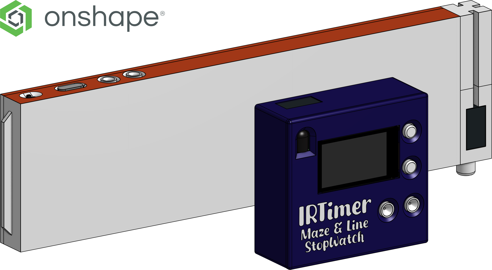

# IRTimer: Maze & Line StopWatch

El diseño de IRTimer se encuentra disponible en [Onshape](https://cad.onshape.com/documents/0bb3dbbb5141aa9193bcd839/w/e93c359765e08a92c0bd40fe/e/a3bf6be277aa9cb775474855?renderMode=0&uiState=682c7f366636964e71366287), donde se puede ver el modelo 3D y descargar los archivos STL para impresión 3D. El modelo incluye tanto el módulo principal como los módulos de laberinto, además de la PCB y el soporte para la pantalla.

