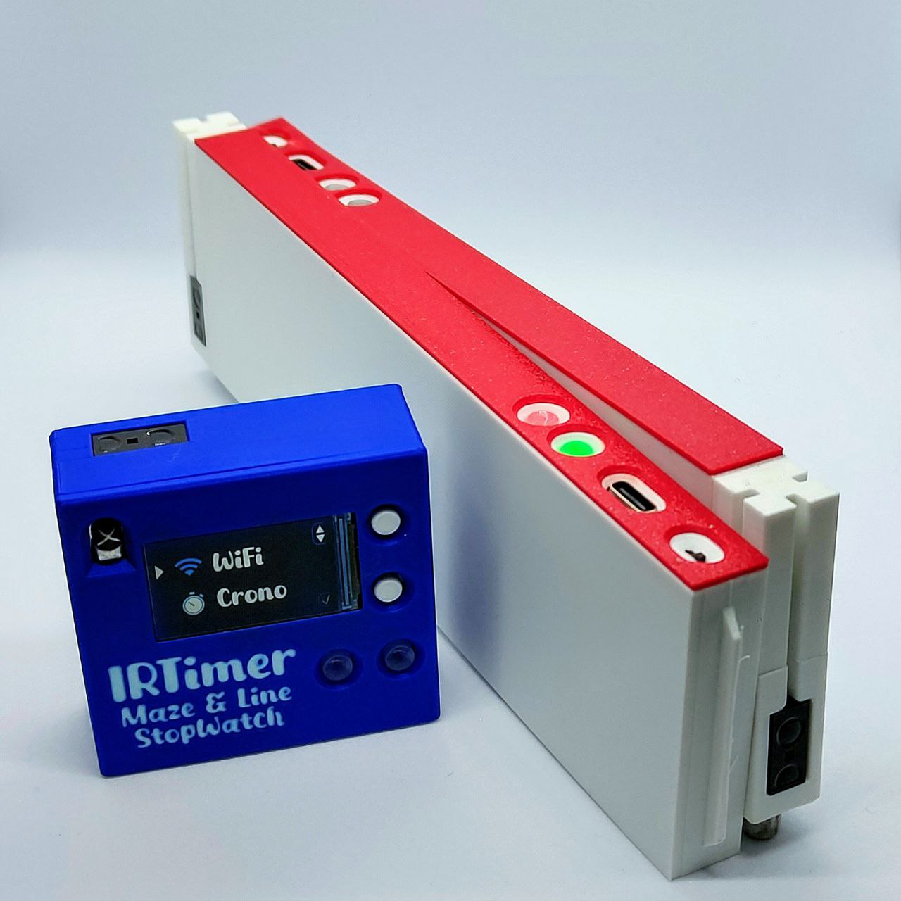
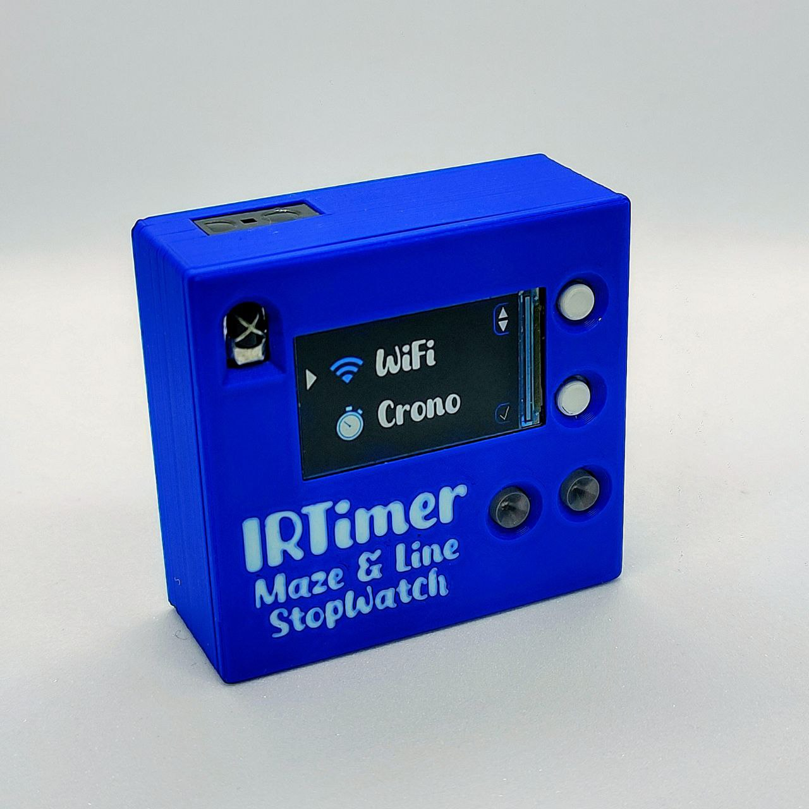
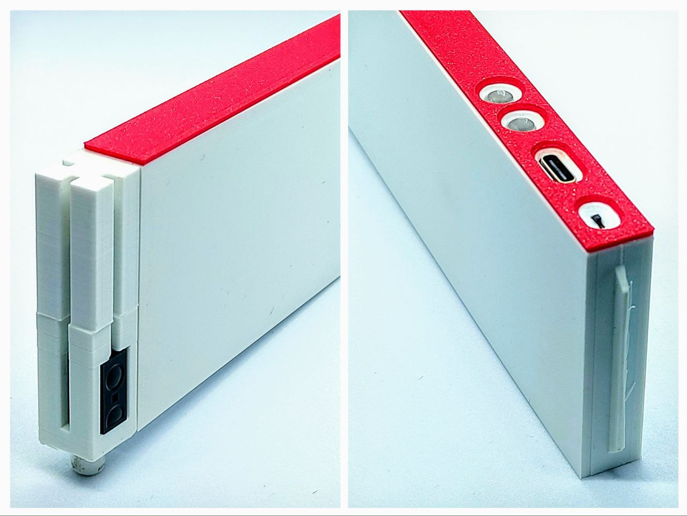
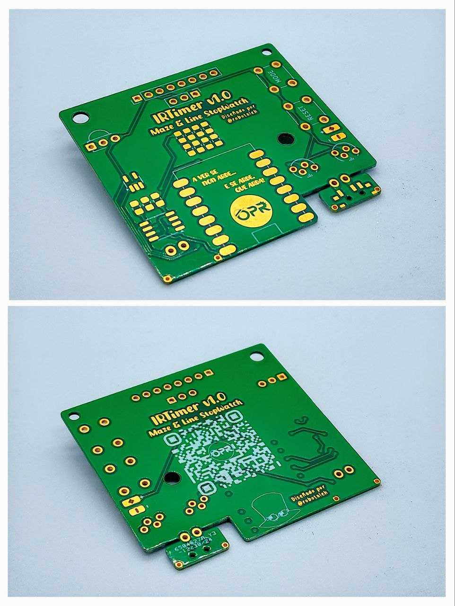

# IRTimer: Maze & Line StopWatch

Cronómetro para MicroMouse y LineFollower con conectividad WiFi para visualización de interfaz gráfica web, permitiendo una simple integración con OBS y softwares similares. Además, tambien posee integración con nuestro sistema de inicio de robots [IRStart](https://github.com/OPRobots/IRStart), desde el cual se podrá detener y reiniciar el cronómetro a distancia.

## Módulo Principal y cronómetro de LineFollower

El módulo principal está pensado para situarse cerca de la línea del circuito para detectar el paso de los robots detectando su paso a través de un sensor infrarojo situado en la parte posterior del mismo.

Este módulo es el encargado de conectarse a la red WiFi local y montar un servidor web para la visualización de cronos en tiempo real. Este servidor web está pensado para poder integrarse de forma simple a modo de overlay en programas de streaming como OBS Studio para mostrar de forma más dinamica a la audiencia los tiempos de los robots. También será el encargado de recibir los comandos de inicio y parada desde los módulos de laberinto mediante ESP-NOW.

### Hardware
- **Microcontrolador**: ESP32-C3 supermini
- **Pantalla**: LCD de 135x240 RGB TFT (ST7789)
- **Sensor**: Sharp GP2Y0D815Z0F (15cm)
- **Receptor IR 38kHz**: TSSP77038TR
- **LEDs**: 2x LEDs RGB (WS2812B)
- **LiPo**: Batería 1S 1500mAh 523450

## Módulo MicroMouse

Estos módulos tienen un hardware muy similar al módulo principal, salvo porque no tienen botones ni pantalla. En este caso, el sensor está embebido dentro del propio poste para interferir lo mínimo posible con las lecturas del robot. Además, el diseño del poste permite multitud de colocaciones para facilitar el montaje en el laberinto.

Las paredes se comunican mediante ESP-NOW con el módulo principal enviando los comandos de START y STOP del cronómetro. Una vez la pared de inicio ha dado la señal, se queda inactiva hasta que se mantenga el sensor detectando por unos segundos para evitar que se inicie una nueva vuelta si el robot vuelve a la casilla inicial (sobre todo en reconocimiento).

### Hardware
- **Microcontrolador**: ESP32-C3 supermini
- **Sensor**: Sharp GP2Y0D815Z0F (15cm)
- **LEDs**: 2x LEDs RGB (WS2812B)
- **LiPo**: Batería 1S 1500mAh 523450

## PCB

Tiene un tamaño muy reducido, menos de 50x50mm, que permite encargarse en los principales fabricantes de PCB con acabado en Oro para más alucinancia. Además, también tiene un total de 6 capas, siendo la primera PCB de OPRobots en tener más de 2 capas.

Contiene los componentes necesarios para cargar la LiPo mediante el conector USB-C del propio ESP32, además de un lector de batería para avisar en caso de que la batería esté baja. Permite la conexión de los RGB tanto en vertical para el módulo principal como en horizontal para los módulos de laberinto.
